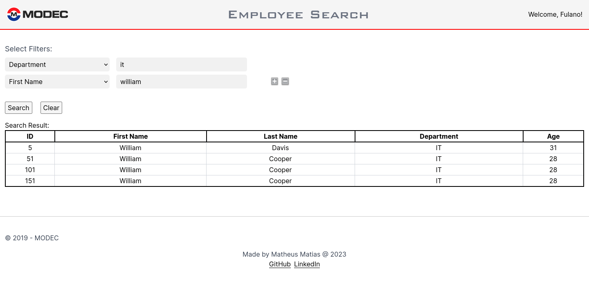

# Modec Tech Challenge

## About:
This is the MODEC's tech challenge implementation. The web application can be accessed [here](https://ambitious-ground-01c27ff10.4.azurestaticapps.net/).

This project is composed of two parts: Database and Webapp.

### Database:
MySQL 8 database to serve employees data.

### Webapp:
The webapp was written in NextJS 13, and is composed of two parts: Backend and Frontend.

Both the database and the webapp are hosted in azure's cloud. The Database is hosted as a "Azure Database for MySQL flexible server" service and the Webapp is hosted as a "Static Web App" service.

All sensitive data is consumed through a secret .env file to load them as environment variables.

#### Backend:
The backend consumes the MySQL database based on params received by the frontend, and return the data in JSON format;

#### Frontend:
The frontend consumes the backend (/api/employees http endpoint, to be more precise) and displays the employees data in a table;


## Features:
Search employees by first name, last name, department and/or age.



## Technologies Used:
- [Docker](https://www.docker.com/) ^24
### Webapp:
- [React](https://react.dev/) ^18
- [Typescript](https://www.typescriptlang.org/) ^5
- [NextJS](https://nextjs.org/) ^13
- [tailwindCSS](https://tailwindcss.com/) ^3.3
### Database:
- [MySQL](https://www.mysql.com/) 8.0

## Local setup:
- Setup environment variables:
```bash
cp .env.example .env
```

- Start the project locally:
```bash
docker compose up -d
```

- If you need to interact with the database, run:
```bash
docker exec -it modec-tech-challenge-db /bin/sh
mysql -u $DB_USER --password=$DB_PASSWORD -D $DB_NAME
```

Now you can access the web application through [**http://localhost:3000**](http://localhost:3000)

## Stop the project:
- To stop the project, run:
```bash
docker compose down
```
